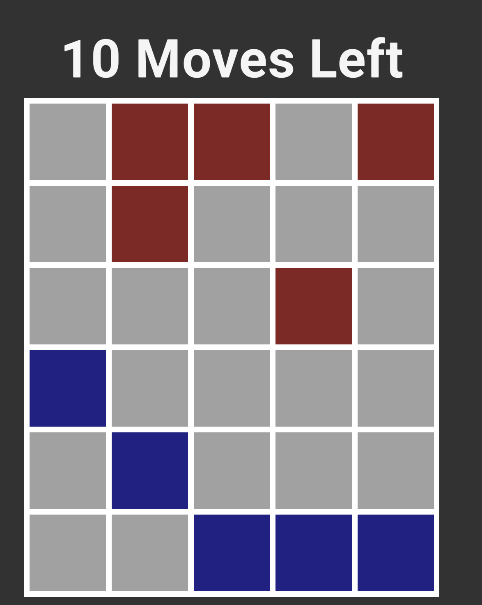
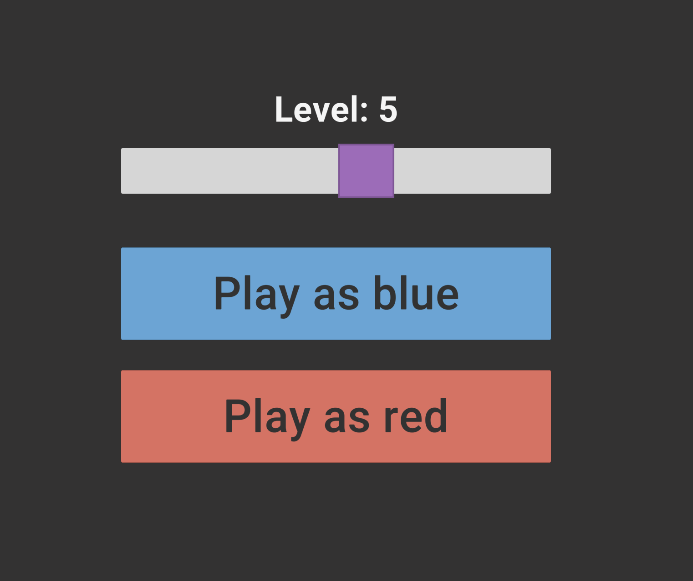

# Thirteen Moves AI

A custom-built strategy game featuring a high-performance heuristic-based AI opponent.

## 📖 About
**Thirteen Moves** is a strategic board game centered around positional dominance. 

### Gameplay
*   **Sides:** Players choose between Blue and Red.
*   **Movement:** Pieces can move forward in three directions (diagonally left, straight, or diagonally right).
*   **Objective:** Be the first to reach the opposing side of the board.

### Balance & Fairness
Because the Blue side holds a natural positional advantage, a unique constraint is applied: Blue must reach the objective within 13 moves. If they fail to do so, Red wins by default. This mechanic ensures a balanced competitive environment for both players.

---

## 🤖 AI Opponent

The built-in agent is powered by a sophisticated **Minimax search algorithm** enhanced with several optimization techniques to provide a challenging experience at various skill levels.

### Technical Specifications
*   **Search Algorithm:** Heuristic-based Minimax.
*   **Optimizations:** 
    *   **Transposition Tables:** Stores previously evaluated positions to avoid redundant calculations.
    *   **Pruning:** Implements Alpha-Beta pruning to significantly reduce the search space.
*   **Performance:** Capable of searching through **700,000+ nodes per second**.
*   **Difficulty Levels:** Users can select multiple levels, which dynamically adjust the search depth of the agent.

---

## 🛠️ Built With
*   [Unity](https://unity.com/) - Game Engine & Rendering.
*   C# - Game Logic and AI Implementation.
